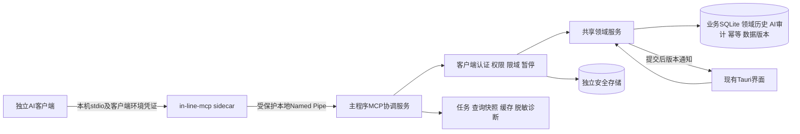

# MCP 架构草案（P0，未实现）

日期：2026-10-09；开发基线 `41383aa` / 0.5.0 / schema v9。本文所有新增组件、表和协议为设计建议，待用户验收；144 项原始决定优先。

## 1. 真实现状与复用边界

| 证据编号 | 当前代码 | 可确认现状及差距 |
| --- | --- | --- |
| S1 | `src-tauri/src/bin/in-line-mcp.rs`，`get_report_summary`、`list_report_items`、`run` | rmcp 3.1.2 + stdio；两工具无独立客户端认证；同步报告；日期≤371天；分页默认100、最大500；错误为字符串 |
| S2 | `src-tauri/src/database.rs`，`open_root`、`open_reporting`、`connect`、`migrate`、`with_conn`、`with_transaction` | 主库 WAL/FK/busy_timeout，Mutex 只协调本进程；只读连接不迁移，低于v9拒绝；生产启动升级前备份；没有跨进程写入协调、数据代际或授权库 |
| S3 | 同文件 `save_task`、`set_status`、`set_urgent`、`create_subtask`、`set_parent_task`、`complete_task`、`delete_task_group`、`record_work_event`、`void_work_event` 等 | 可复用领域规则及 `_on` 辅助；各公共方法自行开事务/锁，不能简单循环组成混合原子批次；全字段 TaskInput 更新无字段并发控制；没有AI长期审计、幂等账本或批准撤销 |
| S4 | `src-tauri/src/database/scheduling.rs`，`replan_on`、`activate_reserved_on`、`activate_due_scheduled` | 已有未来预占、原号不回收、正常/延迟/提前入队、测试时钟；报告连接不调用激活写入；不能重建MCP专用编号规则 |
| S5 | `database.rs`，`statistics`、`report_items`、`work_calendar`、`statistics_trend_details` | 有真实统计、有效事件过滤、归档历史；统计按区间每事项最后有效结果，类型/部门按当前属性；没有客户端限域、跨页快照、变更流、完整性元数据和统计溯源协议 |
| S6 | `database.rs`，`backup_connection`、`restore_backup`、`merge_settings`、`valid_setting` | VACUUM INTO 业务备份、事务非破坏性合并；有效普通设置可恢复；授权数据现在不存在，不能将新安全字段加进可恢复settings；现有逐表恢复需补审计/代际策略 |
| S7 | `src-tauri/src/lib.rs`，`run`、`emit_change`、`mcp_connection_guide`；`src/components/SettingsPanel.tsx`；`src/App.tsx` | 写入后data-changed刷新；MCP UI只有接入说明；启动和single-instance回调都会show_main；Database::open在单实例插件处理前执行；没有静默模式、授权管理、后台任务/故障页 |
| S8 | `src-tauri/tests/mcp_stdio.rs`、database内测试、`.github/workflows/*.yml`、`scripts/prepare-mcp-sidecar.mjs`、`src-tauri/windows/installer-hooks.nsh` | 现有匿名两工具/敏感顶层字段排除有真实stdio测试；sidecar随NSIS安装；release仅v* Tag触发；当前feat分支Push不在CI分支匹配中；安装器会有界终止MCP进程 |
| S9 | `docs/prd/*.md`、README、CHANGELOG、RELEASE_NOTES | 已确认的v0.5未来/子任务/无手动归档规则、只读日历、受保护更新、发布门禁；不能将历史任务正文视为新的执行授权 |

注意：当前报告明细返回真实 `work_events.note`，并非经过通用脱敏。联系人等专用字段未返回，不代表用户写在办理说明中的敏感信息已被移除。

## 2. 建议服务边界



- 所有MCP业务读取与写入都经过主程序协调服务，sidecar仅协议适配；消除sidecar直接开库绕过限域/暂停/代际的路径。
- 主程序是唯一受信任写入协调者；UI命令与MCP命令复用同一领域服务。UI本身仍可使用永久删除/恢复备份，但MCP分发白名单不包含这些命令。
- Windows本地Named Pipe仅用于软件内部IPC，不构成新的HTTP/MCP网络服务；显式拒绝远程管道连接，限制当前用户/登录会话ACL，不采用默认宽泛ACL。
- 不信任客户端自报名称、PID、SID或权限。操作系统身份检查加客户端凭证检查；会话绑定服务端认定的clientId、credentialVersion、authorizationRevision。
- 管道对端校验、首实例防抢占、包长/超时/连接数上限、服务端挑战与证明都要验证；挑战证明以已认证客户端密钥绑定双方nonce、安装实例、协议版本，禁止nonce重放。sidecar不持有能调用全部客户端的共享万能令牌。
- 通用MCP stdout保持逐行协议输出；启动错误和诊断只写stderr或本地脱敏诊断。不得通过stdout输出凭证或业务调试。
- MCP官方将stdio凭证获取与HTTP OAuth区分，stdio使用环境变量等本地方式；不为了认证新增HTTP授权服务器。[MCP授权规范](https://modelcontextprotocol.io/specification/2025-11-25/basic/authorization)
- Named Pipe默认描述符可能向Everyone/匿名账户授予读取，必须显式设置ACL及最小权利。[Microsoft Named Pipe安全说明](https://learn.microsoft.com/en-us/windows/win32/ipc/named-pipe-security-and-access-rights)

### 按需启动及单实例

1. sidecar读取独立安全存储并初步校验环境凭证及暂停状态；无效/缺失凭证不得触发业务库打开或迁移。通过后尝试可信管道；没有服务才从其相邻、校验版本的主程序固定路径启动 `--mcp-background`；不搜索PATH、不接受客户端指定可执行文件。主服务仍独立鉴权，不信任sidecar的初验结论。
2. 在打开/迁移业务库前取得主程序独占协调实例；第二实例只转交启动意图并退出，不先开库或备份。
3. 正常用户启动仍显示主窗；后台启动及后台第二实例都不调用show_main、不抢焦点，也不显示浮窗/通知；托盘可供用户主动打开管理。
4. 启动完成后进行IPC就绪/版本握手；有限超时和指数退避，不循环无限启动；全局暂停持久化且后台启动不能解除暂停。
5. GUI关闭/静默模式下，未来到期检查由现有应用生命周期业务机制负责。认证MCP查询前获取当前有效业务版本；生命周期检查属于主程序原有业务行为，不在只读工具内部伪造写入。
6. 退出导致服务断开时，查询可受控重连；写入先查幂等/提交结果，不能再次发送未核实的执行命令。卸载/升级杀sidecar不能让在途写入重放。

## 3. 身份与权限

- 全局三组初值：常规读取=true，完整读取=false，日常写入=false。新客户端由用户在软件内创建/授权，实际权限是全局开关 ∩ 客户端授权 ∩ 数据范围 ∩ 操作/字段规则；没有凭证一律无业务数据。
- 凭证为密码学随机高熵令牌；界面创建/轮换时仅显示一次，客户端配置使用独立环境变量。应用只保存受保护的校验材料；不在命令行参数、请求体、导出、日志或源代码中回显明文。
- 安全存储拟位于当前用户的本地非漫游专属目录（如 `%LOCALAPPDATA%/In-Line/mcp-security/`），与业务库/backups严格分离；使用当前用户DPAPI保护密钥材料并设置ACL。不得将“缓存不加密”扩展至凭证。客户端侧配置是否明文由第三方客户端决定，引导应如实提示并支持轮换。
- DPAPI并非所有环境下天然跨电脑不可解密（例如漫游配置）；另绑定本机安装实例和可验证机器/用户标识，复制到另一台电脑拒绝使用并要求重新授权，不能仅靠DPAPI声称满足MCP-009。[Microsoft DPAPI说明](https://learn.microsoft.com/en-us/windows/win32/api/dpapi/nf-dpapi-cryptprotectdata)
- clientId/用户可见名称/授权版本/状态/范围/最近访问分别存储。授权用户操作仅通过本机UI管理命令，不发布给AI任何开权限/解除暂停/轮换工具。
- 撤销/轮换/暂停由主服务串行更新安全版本并广播内部失效，下一请求立即失效。提交门禁与授权变更共用协调锁建立顺序：变更生效后的请求不能提交；已进入原子提交区的事务完成或回滚后变更才算生效；UI如实显示生效结果。在途读取分块检查，结果释放再次鉴权。
- 部门/类型范围以服务端规范化规则做交集。多部门事项建议采用**全部所属部门均在授权范围**的保守规则（待确认C4）；不返回范围外父标题、兄弟任务、字典项、计数、报告、审计或导出内容。
- 范围字段修改同时检查修改前/后；建立关系检查父子两端及受影响成员；整组完成/删除检查全部实际受影响事项，不能只校验父任务。
- 常规投影建议包括ID、标题、类型、授权部门、状态、工作量、计划/截止时间、队列/父子基础信息及有效办理结果/时间；联系人、正文、内部备注、加急申请说明、原始操作日志/办理自由文本按完整读取权限控制。两旧工具仍保留汇总/明细业务用途，敏感自由文本投影变化必须写迁移说明。
- 高频/失败限流区分可信客户端和无效身份来源；未认证者不能用自报clientId让无辜已授权客户端被锁。cooldown不恢复revoked状态。

## 4. 领域事务、幂等、冲突与撤销

### 共享领域层

逐项提取现有事务内操作为接受同一 `Transaction` / `DomainContext` 的函数，UI原入口包装调用它们；不复制SQL规则到MCP。先通过现有队列/统计/子任务测试再接MCP。开始时保留v9存量字段与永久身份。

混合批次只能一次取得写入协调权、一次BEGIN、逐项领域操作及审计、一次COMMIT。循环调用各自提交的公共Database方法不满足原子性。默认限制20个**实际受影响事项**，同批操作条数/字节亦有硬资源上限；父子展开、临时新建ID引用、筛选展开均计入，超限拒绝整批。

### 明确意图与预演

固定ID或受控候选消歧，不能以标题猜对象。批次任何歧义/越权/业务冲突即全批不执行。筛选批次先冻结稳定目标清单，提交时复核。Dry Run在隔离内存副本运行同一领域规则，不能在生产库先写后回滚假装只读；展示号码分配为预计，正式提交以最新高水位为准，变化须报差异，关键意图变化要求再确认。

AI可以按明确用户意图构建操作，不能用自填 `confirmed=true` 冒充用户批准撤销。授权范围内无需每项软件弹窗；已有重新计划等二次确认的渠道问题待C2裁决。不要用语言模型提取作为唯一授权依据。

### 写入请求状态

- `(clientId, idempotencyKey)`唯一，规范化请求摘要、授权修订、操作清单、状态和结果同业务提交记录；相同键不同请求拒绝。
- 同一事务写入业务+前后审计+变更序号+幂等结果，不把结果写另一库后假装双库原子。
- 提交前进程崩溃：事务回滚；提交后断开：重连读取幂等账本核验，不执行补写。无法读取结论则返回 `outcome_unknown`。
- 幂等账本不能被7天结果清理、30天任务清理或普通缓存清理删除；长期保留已用键的摘要/结果证据，用户清审计时保留最低防重复执行账本。
- MCP乐观并发使用字段基准值/版本；不同字段可合并，但领域联动字段（status/queue/schedule/urgent/deadline/parent）按约束组整体检查。UI写入也递增同一版本。时间字符串updated_at不能替代可靠版本。
- 已达到目标状态默认 `no_change` 且无新事件；显式重新排队是独立领域操作。现有set_status可能有入队/清加急副作用，须在统一领域语义和MCP前置检查中验证，不直接视为无副作用。
- COMMIT成功后核验关键状态/关系/编号和审计关联；结果壳区分 `committed_verified`、`committed_verification_failed`、`outcome_unknown`。UI刷新失败不等于业务提交失败，也不能触发写入重试。
- 临时技术失败最多自动重试2次，权限/业务冲突不重试；写请求仅当幂等账本确认未提交才允许重试，不确定时只读核验。

### 长期审计与批准撤销

业务库拟新增AI审计请求/事项差异表，保存来源、clientId非秘密标识、解释、before/after、关联ID、实际结果，默认无限期。审计引用不能依赖会被永久删除级联清除的tasks外键；UI永久删除后保留受控审计证据，AI读取仍执行当前授权。

撤销=AI提出申请 → 用户在软件内查看范围/影响并批准 → 复核当前版本/字段/关系 → 新领域事务执行逆向可支持操作 → 新审计。不能通过备份恢复、直接UPDATE旧快照、重用作废号码或删真实历史完成撤销。重排期/已发生办理等不可安全完全逆转时明确拒绝或请求用户选定受支持的纠错方案；不得承诺所有写入可无条件回滚。

## 5. 储存域和迁移

| 域 | 拟存内容 | 备份/清理边界 |
| --- | --- | --- |
| 业务inline.db | 现有事项/编号/队列/办理；AI长期审计、幂等账本、数据版本/代际、权威变更事件 | 随业务备份；恢复需合并且避免旧ID冒充新对象；不恢复凭证；业务审计默认无限期 |
| 独立安全存储 | 客户端校验材料、组/范围、暂停、撤销/轮换、授权版本、机内绑定 | 不在业务备份/导出/普通settings；同机升级保留，换机重新授权；损坏fail closed |
| 任务存储 | 请求/执行轮次、等待关系、只读检查点、快照引用、期限 | 摘要30天、临时结果7天、异常恢复窗口24小时；不能用业务备份复活运行任务 |
| 派生索引/快照/缓存 | 可再生索引；受配额只读快照；缓存 | 与长期审计分离；缓存内存优先，磁盘仅ACL且尽量不含正文；快照/检查点不是可随意删除缓存 |
| 技术诊断/故障摘要 | 脱敏请求信息、错误关联、轮次、恢复证据 | 独立轮转；已恢复摘要30天、未恢复不按期限删；手动脱敏导出 |

未来业务schema号在P1按最新实际库确定，不提前指定10并修改代码。迁移流程：写协调独占 → 检查版本及空间 → 独立命名受保护迁移备份 → integrity/FK检查 → 原子schema迁移 → 后检查 → 正常开放服务；迁移及失败处理期间禁止并发备份清理删除安全副本。失败保留旧库和备份、停止服务，不自动反复迁移；迁移成功后仍遵循现有用户主动确认的备份清理规则，不擅自新增永久不可清理类别。保护协调策略在P1验收。

恢复仍为UI发起的非破坏性合并，不开放MCP恢复工具。恢复前暂停协调读写及任务，在业务事务中提升dataGeneration，旧游标/快照/缓存失效；后校验再发布版本。安全库原值/撤销状态/暂停不能随业务settings改变。恢复审计及账本以原库UUID+来源操作ID去重，不用旧clientId建立当前授权；导入的旧幂等键标记历史来源，不执行请求。

## 6. 版本、快照及增量

拟数据结构：

```text
DataVersion {databaseUuid, dataGeneration, commitSequence, schemaVersion,
             querySchemaVersion, statisticsDefinitionVersion}
QuerySnapshot {id, clientId, authorizationRevision, filterHash, projection,
               dataVersion, orderedStableKeys, expiresAt, completeness, gaps}
ChangeCursor {mode, generation, lastScannedSequence, filterHash,
              clientScopeRevision, issuedAt, expiresAt, integrityProof}
ChangeEvent {sequence, transactionId, entityId, operation, beforeScope,
             afterScope, changedFields, occurredAt}
```

- GUI、MCP、未来到期、导入/纠错/删除等所有业务写路径都要同步维护版本和事件；不能只记录MCP写。授权修改独立提升authorizationRevision。
- 复杂查询用短只读事务建立受配额快照/受保护只读数据库副本，跨页读取同一基准，不长期锁生产写事务。仅冻结ID后再读变化内容不算一致快照；内容变化须从固定快照取或返回失效。
- 缓存与查询快照用途不同：缓存按数据变更失效，有限查询快照用于相同分页基准；授权缩减/撤销一律立即失效；后台恢复只能在能够验证该任务基准仍有效时继续，不能混版本。
- 游标完整性校验绑定客户端/范围/查询模式；当前状态模式按扫描区间聚合，但推进**lastScannedSequence**，不能用最后输出行进度漏掉隐藏/重复事件。
- 离开授权范围/筛选条件或软删除：只为曾在该客户端同步集合中的对象返回必要ID脱离标记，不暴露新部门/正文或范围外对象存在性；授权整体变更可要求全量重同步。
- 老库没有可靠变更事件：记录起始水位与历史缺口，允许当前状态全量同步；派生索引重建不伪造旧事件。永久删除由GUI触发时生成必要无正文墓碑，MCP不可发起永久删除。
- 当前371天报告限制是旧工具契约；全历史查询不得受同一限制。旧接口新上限100为明确破坏变化；保持工具名是否最终移除在P8另获批准。

## 7. 长任务与缓存

```text
Request {id, clientId, intentHash, callerId, explicitRequery}
Execution {id, requestId, attempt, baseline, status, autoRequeryCount}
Job {id, ownerClientId, executionId, progress, checkpoint, createdAt,
     firstPausedAt, recoveryDeadline, summaryExpiresAt, resultExpiresAt}
Waiter {id, jobId, callerId, cancelledAt}
```

状态：queued/running/pause_pending/paused/cancel_requested/cancelled/completed/failed/expired/outcome_unknown。执行轮次与用户请求分离，最终有效结果只能来自一个完整轮次。

- 长任务在主程序服务中运行，sidecar断开不丢生命周期；取消等待者不等于取消共享任务。跨客户端不共享任务或结果。
- 同客户端在途复用须匹配参数、投影、授权版本、数据基准及口径，明确重查例外。完成结果还检查TTL/配额/当前版本；返回来源任务和生成时间。
- 限流暂停从firstPausedAt累计最多30分钟；进程异常检查点从首次可恢复中断时刻最多24小时，不因重启续期。恢复前检查授权/范围/暂停/期限/基准，数据变化不得继续读取混合结果。
- 基准失效且用户允许最新数据时终止旧轮次、从头完整重查最多1次；不续接半个旧结果。业务写入仅核验账本，不重放。
- 内存缓存优先；必要磁盘缓存使用专属ACL、大小/TTL/LRU、最小字段，不能落凭证或完整正文；ACL不能隔离同账户进程，这是已选择方案的残余风险。若收益不明确，P6可实现内存层并记录磁盘启用决策，不将磁盘强行开启。
- 摘要30天、临时结果7天、恢复窗口24小时分别计时；快照引用按任务有效性及配额保留，磁盘缓存“清理”不能破坏运行检查点或正式导出。

## 8. 诊断、故障及UI

- 技术日志先按字段白名单收集；错误栈本地保存并轮转，不直接返回AI。诊断工具只按自身errorId返回脱敏信息，未知/他人编号均不能探测存在性。
- 关联request/job/execution/error/audit，故障按客户端/模块/证据聚合独立轮次；恢复措施后先待验证，相关真实功能成功并满足稳定检查才恢复。
- 滚动30天3个相关独立轮次提升关注；不自动提升缺陷严重度/权限。普通静音7天，到期/风险提升解除，P0/P1不可静音；未解决不自动超期删除。
- CSV/JSON由用户在应用内手动按基础状态导出。字段白名单→敏感检查→预览→一次确认→将**同一冻结内容**写入并核验；CSV防公式注入。包含事实/推测分开的简述和Codex提示词、故障/导出两时点版本及真实可得commit；不生成哈希清单，不自动上传/调用外部AI。
- MVP UI放现有设置内紧凑MCP区：三组开关、暂停、客户端列表、创建/复制配置/轮换/撤销、最近访问结果；诊断/任务/审计按需展开，低频用小对话框。不得将“已授权”“最近访问”“连接测试成功”混称在线。
- 用户侧批准撤销与敏感授权初启提示在应用内完成；操作/任务通知聚合成现有轻提示，后台不弹Windows通知。

## 9. 风险与冻结前决定

产品冲突 C1–C4 和选项详见PHASE-00。核心风险：领域提取引入回归、跨进程/撤销竞态、恢复复活身份或重复操作、分页/长任务混合基准、自由文本泄漏、安装杀进程导致结果不明。以上分别由P1/P3/P4/P5/P6/P7/P8负面用例阻断；本轮没有验证新增实现。
